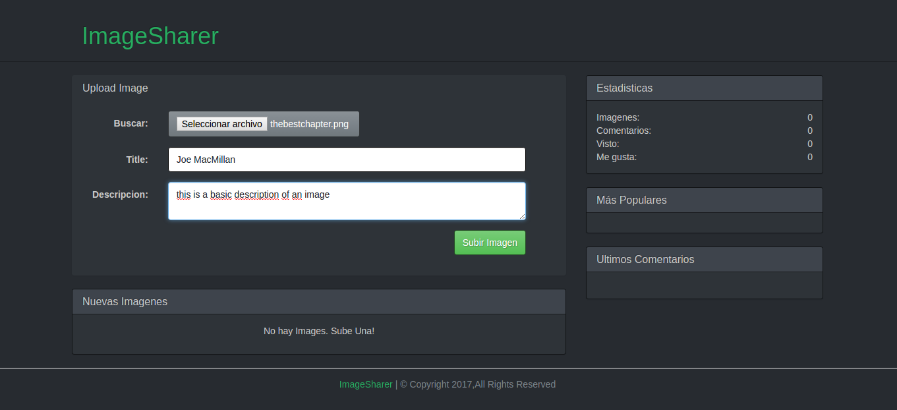

## What is this about
This is a web examples based on Imgur.com

## ScreenShoots

## Instalation
 1. inside the proyect: `cd social_image_sharing_webapp`
 2. execute: `npm install && npm start`
    - (you have to be running mongodb)

## Related
  Gravatar
